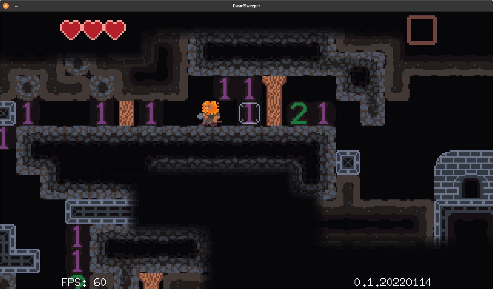

# DwarfSweeper

Descend as deep as you can in the bomb-filled depths of the mountain! DwarfSweeper was created initially for the Ludum Dare 48 game jam with the theme **Deeper and Deeper**. I plan on continuing development for now.

### Controls

A/D to move left and right

W/S to climb

Space to Jump

Use the mouse to select blocks to dig (left click) or mark (right click)

Q to pick up and drop items and interact

E to use equipped item

Use the mouse wheel to select between items

Controllers are supported

Controls can be remapped!

### Credits

Gameplay and Graphics
Tim Sims

Sound
Alexander Kopeikin
PMSFX

Music
Ben Reber

Pixel Art
Kenney

Special Thanks:
My wife Kaylan,
Marshall and Clark,
faiface and the Pixel team,
the Ludum Dare LD48 team.

Thank you for playing!

### DwarfSweeper Links

[DwarfSweeper on Github](https://github.com/timsims1717/dwarf-sweeper)

[DwarfSweeper on Itch (Original LD48 Version)](https://thetimsims.itch.io/dwarfsweeper)

[DwarfSweeper Ludum Dare Entry](https://ldjam.com/events/ludum-dare/48/dwarfsweeper)

[DwarfSweeper Builds on Dropbox](https://www.dropbox.com/scl/fo/zvga0ibw5wsm9th2os3ht/h?dl=0&rlkey=9zdbzhqyvisrixwpwtcrdel8j)

### Resources/Credits

[Pixel by Faiface](https://github.com/faiface/pixel) (Graphics Library)

[Beep by Faiface](https://github.com/faiface/beep) (Audio Library)

[Music by Ben Reber](https://soundcloud.com/user-411047148)

[Input Prompts by Kenney](https://kenney-assets.itch.io/input-prompts-pixel-16)