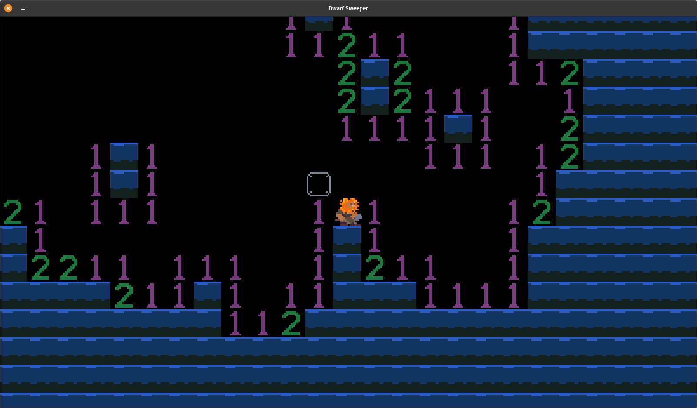

# DwarfSweeper

Descend as deep as you can in the bomb-filled depths of the mountain!

A/D to move left and right, W to jump. Use the mouse to select blocks to dig, but watch out for bombs! You dig with the left mouse button and mark blocks with the right mouse button.

Made by Tim Sims for Ludum Dare 48
(DEEPER AND DEEPER)
using Pixel, a 2d Engine written in Go.

Sound from the PMSFX Sampler March 2021

Special Thanks:
My wife Kaylan,
Marshall and Clark,
faiface, the Ludum Dare LD48 team,
and YOU!

Thanks for playing!

https://github.com/timsims1717/dwarf-sweeper

https://thetimsims.itch.io/dwarfsweeper

https://ldjam.com/events/ludum-dare/48/dwarfsweeper